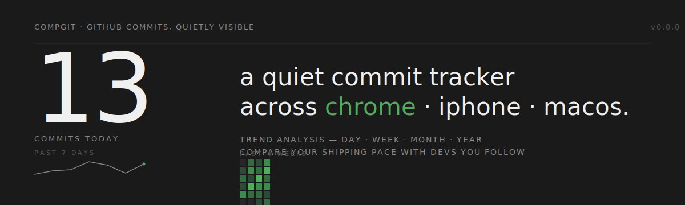

<p align="center">
  
</p>

<p align="center">
  <em>GitHub commits, quietly visible — across a Chrome extension, an iPhone widget, and a macOS widget.</em>
</p>

<p align="center">
  <a href="#getting-started">Getting started</a> ·
  <a href="#what-ships-today">What ships today</a> ·
  <a href="#design">Design</a> ·
  <a href="./CLAUDE.md">CLAUDE.md</a> ·
  <a href="./NEXT-TO-DO.md">Next to do</a> ·
  <a href="./wiki/Home.md">Wiki</a>
</p>

---

## Why

Most developers never look at their own contribution graph unless they're applying for a job. compgit makes today's ship count ambient — on the browser you're already in, the phone on your desk, and the desktop you're working from. Shipping becomes a thing you see, not a thing you check.

Three surfaces, one schema:

- **Chrome extension** (popup + side panel) — today, heatmap, 4-period trends.
- **iPhone widget** (Home Screen + Lock Screen) — today's count + 7-day sparkline. *(Phase 2b)*
- **macOS widget** (desktop + menu bar) — same, ambient. *(Phase 2b)*

And a comparison tab to see your pace against the devs you follow. *(Phase 3)*

## What ships today

| Phase | What | Status |
|---|---|---|
| 0 | Monorepo, schema-as-source-of-truth, TS + Swift codegen, CI | ✅ done |
| 1 | Chrome extension MVP — popup, side panel, options, background refresh | ✅ done |
| 2a | Swift core — `GitHubClient`, `SharedStore`, `KeychainPAT`, aggregation | ✅ done |
| 2b | iOS + macOS Xcode projects + widget extensions | 🟡 blocked on Xcode install |
| 3 | Follow devs and compare | planned |
| 4 | Cloudflare Worker + OAuth | planned |
| 5 | Hour-of-day trends, Lock Screen widget, macOS menu bar, store releases | planned |
| 6 | Crash reporting, opt-in heartbeat, status page, support triage | planned |

See [`NEXT-TO-DO.md`](./NEXT-TO-DO.md) for the resumable checklist; per-phase architecture lives in [`wiki/entities/`](./wiki/entities/).

## Getting started

```bash
git clone https://github.com/lonexreb/compgit
cd compgit
pnpm install
pnpm gen:schema        # emits TS + Swift models from packages/schema
pnpm typecheck
pnpm lint
pnpm test              # 43 Vitest tests over packages/shared-ts
```

### Run the Chrome extension

```bash
pnpm -F @compgit/chrome dev       # launches Chrome with the unpacked extension
```

1. On first install, the Options page opens automatically.
2. Paste a [fine-grained GitHub PAT](https://github.com/settings/personal-access-tokens/new) with `read:user` scope.
3. Click the compgit icon in the toolbar to see today's count; right-click the icon → "Open side panel" for the heatmap and trends.

### Build the Swift package

```bash
cd packages/shared-swift && swift build
```

Compiles `CompgitSchema` + `CompgitCore` on Command Line Tools alone. The iOS/macOS apps that consume it require full Xcode (Phase 2b).

### Build for production

```bash
pnpm -F @compgit/chrome build        # Chrome / Edge / Brave / Arc
pnpm -F @compgit/chrome build:firefox
```

Outputs land in `apps/chrome/.output/`. Popup and sidepanel bundles stay under 11 KB gzipped; total with self-hosted fonts is ~470 KB.

## Repo layout

```
compgit/
├── apps/
│   ├── chrome/          WXT extension (React + Tailwind v4)    ✅ shipped
│   ├── ios/             Xcode project                          🟡 Phase 2b
│   ├── macos/           Xcode project                          🟡 Phase 2b
│   └── worker/          Cloudflare Worker                      📋 Phase 4
├── packages/
│   ├── schema/          compgit.schema.json — source of truth
│   ├── shared-ts/       GitHub client, cache, aggregation, Zod
│   └── shared-swift/    CompgitCore (GitHubClient, SharedStore,
│                        KeychainPAT, Aggregate, Time, Errors)  ✅ shipped
├── tools/
│   └── schemagen/       JSON Schema → TS + Swift emitter
├── wiki/                Obsidian vault — project knowledge base
│   ├── Home.md
│   ├── entities/        One file per concept (Karpathy wiki style)
│   ├── decisions/       Dated decisions log
│   ├── daily/           Daily notes
│   └── glossary.md
├── assets/              SVG banner + any shipped static assets
├── CLAUDE.md            Agent runbook
├── MEMORY.md            Compounding project memory
├── NEXT-TO-DO.md        Resumable checklist — what to pick up next
└── README.md
```

## Design

compgit uses **Terminal Editorial** direction: dark by default, [Fraunces](https://fonts.google.com/specimen/Fraunces) for display numerals, [JetBrains Mono](https://www.jetbrains.com/lp/mono/) for body, one accent colour used sparingly. No shadows, no gradients — hierarchy from scale contrast.

All three surfaces share a single JSON Schema (`packages/schema/compgit.schema.json`) that codegens both the TypeScript and Swift types. A CI gate fails the build if the emitted files drift from the schema.

Read the full design + architecture notes in the [wiki](./wiki/Home.md).

## Development

Full phase plan, verification steps per phase, and architectural decisions live in the [wiki's decisions log](./wiki/decisions/).

- `pnpm test` — Vitest over the shared package (43 tests, ~97% coverage on pure modules).
- `pnpm typecheck` — tsc across all TS workspaces via Turborepo.
- `pnpm lint` / `pnpm format` — Biome.
- `pnpm check:schema-drift` — regenerates the model code and fails if it differs from what's committed.
- `cd packages/shared-swift && swift build` — builds the Swift core.

## Knowledge base

The `wiki/` folder is a live Obsidian vault. Open it with **File → Open Vault → `path/to/compgit/wiki`** to get backlinks and graph view. The vault follows Karpathy-style wiki management:

- **Atomic entity pages** — one concept per file, heavy `[[wikilinks]]`.
- **Dated decisions** — every fork in the road lives in `decisions/YYYY-MM-DD-slug.md` and names its alternatives.
- **Daily notes** — short progress log, 3–6 bullets per day.

## Licence

MIT.
